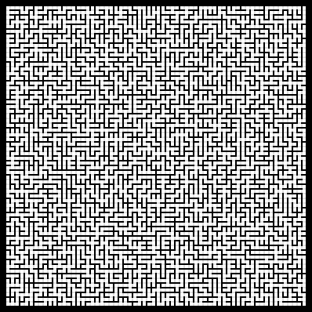
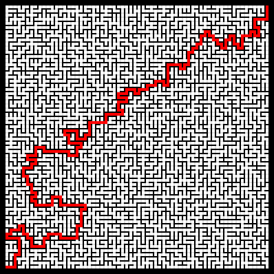
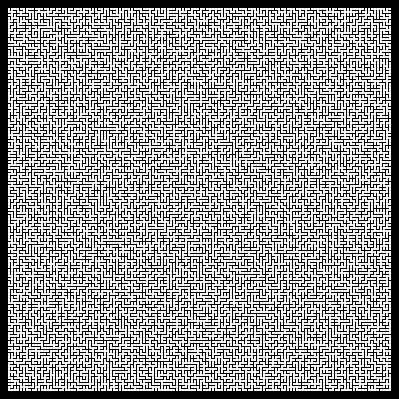
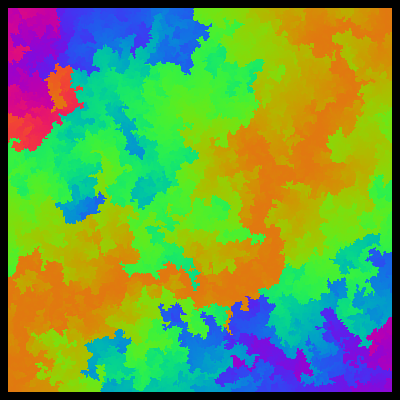

# Mazart


This software generates a 2D maze PNG image.  There are several options
available for creating interesting image patterns.

## How to Build

### Dependencies

*   [GCC](https://gcc.gnu.org/) C compiler
*   [GNU Make](https://www.gnu.org/software/make/) for building project
*   [libpng](http://www.libpng.org/pub/png/libpng.html) for generating images

### Install Dependencies

*   For Arch Linux
```
$ sudo pacman -S gcc make libpng
```

*   For _most_ Debian distributions
```
$ sudo apt-get install gcc make libpng-dev
```

### Build Project

```bash
# From what ever directory you put your code in
git clone git@github.com:SuperOxigen/mazart.git
cd mazart
make
```

## How to Use

Currently, the UI for the program is greatly lacking and is in need of
improvement.  To see what options are currently available, you can use the
`--help` flag when you run the program.  You must include an output file
`--output`.

```
$ ./bin/mazart.exe --help
$ ./bin/mazart.exe --output my_maze.png
```

### Examples

*   Simple maze



```
$ ./bin/mazart.exe --output basic.png
```

*   Simple maze with solution



```
$ ./bin/mazart.exe --draw-path --output basic.sol.png
```

*   Large maze, small details



```
$ ./bin/mazart.exe --maze-height 128 --maze-width 128 \
  --cell-width 2 --wall-width 1 --output dense.png
```

*   Colorful artwork



```
$ ./bin/mazart.exe --maze-height 384 --maze-width 384 \
  --cell-width 1 --wall-width 0 --cell-mode palette --cell-metric path \
  --output colorful.png
```

### Performance

Program _run time_ mostly depends on the maze dimensions that you provide
(`--maze-width` and `--maze-height`).

Program _memory consumption_ depends on image dimensions; combination of maze
dimensions and widths of cells, walls, and border (`--cell-width`,
  `--wall-width` and `--border-width`).

There are several maximum values that the program allows currently.  Run
program with `--help`, and read the description for each flag to get their
maximum.  If you want, you can modify these maximums in [config.c](src/config.c).


---
## License

This project is distributed under the [MIT License](https://opensource.org/licenses/MIT).
Please see [LICENSE](LICENSE) for more details.

## Contributing and Feature Suggestions

Check out the [CONTRIBUTING.md](CONTRIBUTING.md) doc for information on how
to contribute to the project.

If you have suggestions for features that you think others would enjoy,
please open an [issue](https://github.com/SuperOxigen/mazart/issues) on the
project's GitHub page.
